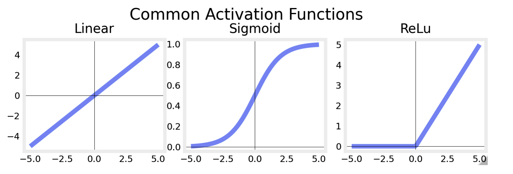
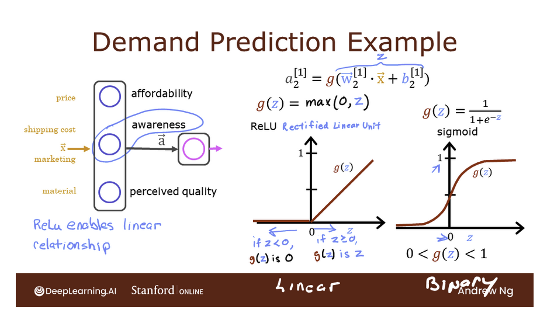
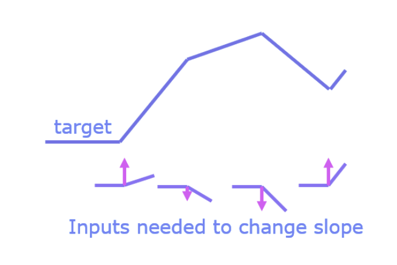
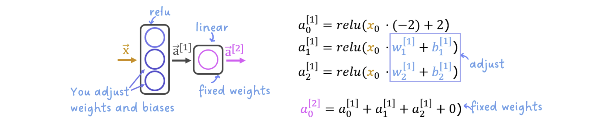
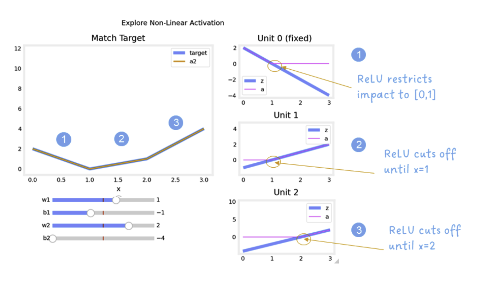
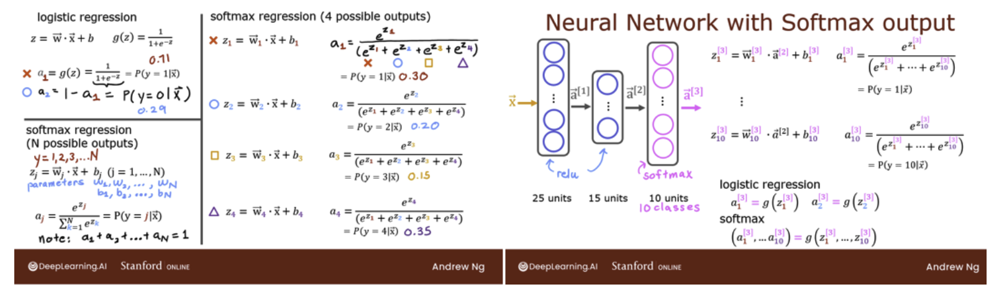
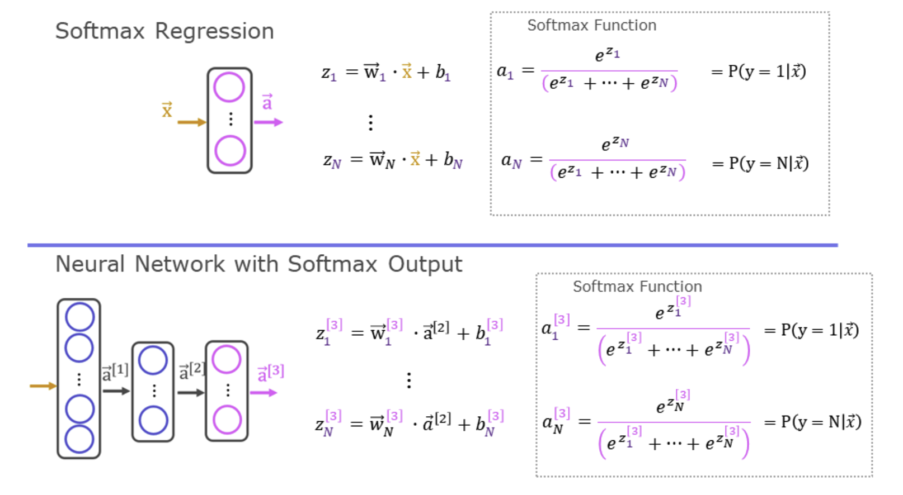
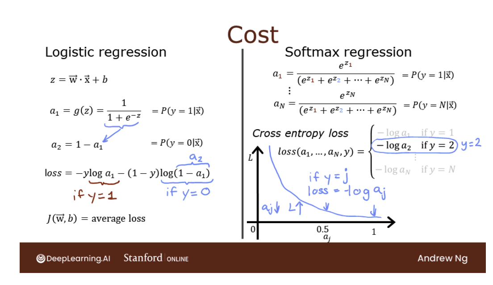
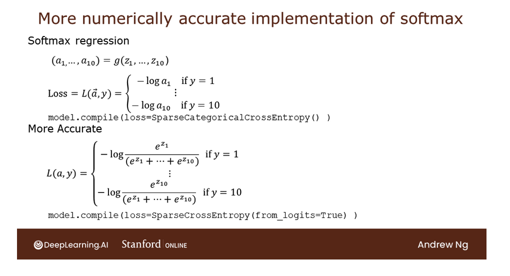

# Advanced Learning Algorithms

## Key Concepts

### Neurons and Layers

**Regression/Linear Model**

The function implemented by a neuron with no activation is the same as in Course 1, linear regression:

$$ f_{\mathbf{w},b}(x^{(i)}) = \mathbf{w} \cdot x^{(i)} + b $$

**Neuron with Sigmoid activation**

The function implemented by a neuron/unit with a sigmoid activation is the same as in Course 1, logistic  regression:

$$ f_{\mathbf{w},b}(x^{(i)}) = g(\mathbf{w}x^{(i)} + b)$$

where $$g(x) = sigmoid(x)$$ 

### ReLU Activation

This week, a new activation was introduced, the Rectified Linear Unit (ReLU). 

$$ a = max(0,z) $$

The example from the lecture on the right shows an application of the ReLU. In this example, the derived "awareness" feature is not binary but has a continuous range of values. The sigmoid is best for on/off or binary situations. The ReLU provides a continuous linear relationship. Additionally it has an 'off' range where the output is zero. The "off" feature makes the ReLU a Non-Linear activation. Why is this needed? Let's examine this below. 

**Why non-linear activations?**

The function shown is composed of linear pieces (piecewise linear). The slope is consistent during the linear portion and then changes abruptly at transition points. At transition points, a new linear function is added which, when added to the existing function, will produce the new slope. The new function is added at transition point but does not contribute to the output prior to that point. The non-linear activation function is responsible for disabling the input prior to and sometimes after the transition points. The following exercise provides a more tangible example.

A regression problem where you must model a piecewise linear target:

The network has 3 units in the first layer. Each is required to form the target. Unit 0 is pre-programmed and fixed to map the first segment. You will modify weights and biases in unit 1 and 2 to model the 2nd and 3rd segment. The output unit is also fixed and simply sums the outputs of the first layer.  

 
The goal of this exercise is to appreciate how the ReLU's non-linear behavior provides the needed ability to turn functions off until they are needed. Let's see how this worked in this example.

The plots on the right contain the output of the units in the first layer.   

Starting at the top, unit 0 is responsible for the first segment marked with a 1. Both the linear function $z$ and the function following the ReLU $a$ are shown. You can see that the ReLU cuts off the function after the interval [0,1]. This is important as it prevents Unit 0 from interfering with the following segment. 

Unit 1 is responsible for the 2nd segment. Here the ReLU kept this unit quiet until after x is 1. Since the first unit is not contributing, the slope for unit 1, $w^{[1]}_1$, is just the slope of the target line. The bias must be adjusted to keep the output negative until x has reached 1. Note how the contribution of Unit 1 extends to the 3rd segment as well.

Unit 2 is responsible for the 3rd segment. The ReLU again zeros the output until x reaches the right value.The slope of the unit, $w^{[1]}_2$, must be set so that the sum of unit 1 and 2 have the desired slope. The bias is again adjusted to keep the output negative until x has reached 2. 

The "off" or disable feature  of the ReLU activation enables models to stitch together linear segments to model complex non-linear functions.

### Softmax Function
This function is used in both Softmax Regression and in Neural Networks when solving Multiclass Classification problems. 

In both softmax regression and neural networks with Softmax outputs, N outputs are generated and one output is selected as the predicted category. In both cases a vector $z$ is generated by a linear function which is applied to a softmax function. The softmax function converts $z$ into a probability distribution as described below. After applying softmax, each output will be between 0 and 1 and the outputs will add to 1, so that they can be interpreted as probabilities. The larger inputs will correspond to larger output probabilities.

The softmax function can be written:
$$a_j = \frac{e^{z_j}}{ \sum_{k=1}^{N}{e^{z_k} }} \tag{1}$$

The output $\mathbf{a}$ is a vector of length N, so for softmax regression, you could also write:

$$
\begin{aligned}
\mathbf{a}(x) =
\begin{bmatrix}
P(y = 1 | \mathbf{x}; \mathbf{w},b) \\
\vdots \\
P(y = N | \mathbf{x}; \mathbf{w},b)
\end{bmatrix}
\frac{1}{ \sum_{k=1}^{N} e^{z_k} }
\begin{bmatrix}
e^{z_1} \\
\vdots \\
e^{z_{N}} 
\end{bmatrix}
\end{aligned}
$$

**Cost**

The loss function associated with Softmax, the cross-entropy loss, is:

$$L(\mathbf{a},y) = \begin{cases} - \log(a_1), & \text{if } y = 1 \\ \vdots \\ - \log(a_N), & \text{if } y = N \end{cases}$$

Where y is the target category for this example and $\mathbf{a}$ is the output of a softmax function. In particular, the values in $\mathbf{a}$ are probabilities that sum to one.
>**Recall:** In this course, Loss is for one example while Cost covers all examples. 
 
 Note in (3) above, only the line that corresponds to the target contributes to the loss, other lines are zero. To write the cost equation we need an 'indicator function' that will be 1 when the index matches the target and zero otherwise. 

$$\mathbf{1}\{y = n\} = \begin{cases}
1, & \text{if } y = n \\
0, & \text{otherwise}
\end{cases}
$$

Now the cost is:

$$
\begin{aligned}
J(\mathbf{w},b) = -\frac{1}{m} \left[ \sum_{i=1}^{m} \sum_{j=1}^{N}  \mathbf{1}\{y^{(i)} = j\} \log \frac{e^{z^{(i)}_j}}{\sum_{k=1}^N e^{z^{(i)}_k} } \right] 
\end{aligned}
$$

Where $m$ is the number of examples, $N$ is the number of outputs. This is the average of all the losses.

**Preferred**

Recall from lecture, more stable and accurate results can be obtained if the softmax and loss are combined during training. This is enabled by the 'preferred' organization shown here.

In the preferred organization the final layer has a linear activation. For historical reasons, the outputs in this form are referred to as logits. The loss function has an additional argument: from_logits = True. This informs the loss function that the softmax operation should be included in the loss calculation. This allows for an optimized implementation.

### Derivatives

The formal definition of derivatives can be a bit daunting with limits and values 'going to zero'. The idea is really much simpler. 

The derivative of a function describes how the output of a function changes when there is a small change in an input variable.

Let's use the cost function $J(w)$ as an example. The cost $J$ is the output and $w$ is the input variable.  

Let's give a 'small change' a name *epsilon* or $\epsilon$. We use these Greek letters because it is traditional in mathematics to use *epsilon*($\epsilon$) or *delta* ($\Delta$) to represent a small value. You can think of it as representing 0.001 or some other small value.  

$$
\begin{equation}
\text{if } w \uparrow \epsilon \text{ causes }J(w) \uparrow \text{by }k \times \epsilon \text{ then}  \\
\frac{\partial J(w)}{\partial w} = k \tag{1}
\end{equation}
$$

This just says if you change the input to the function $J(w)$ by a little bit and the output changes by $k$ times that little bit, then the derivative of $J(w)$ is equal to $k$.

Let's try this out.  Let's look at the derivative of the function $J(w) = w^2$ at the point $w=3$ and $\epsilon = 0.001$

**Finding symbolic derivatives**

In backprop it is useful to know the derivative of simple functions at any input value. Put another way, we would like to know the 'symbolic' derivative rather than the 'arithmetic' derivative. An example of a symbolic derivative is,  $\frac{\partial J(w)}{\partial w} = 2 w$, the derivative of $J(w) = w^2$ above.  With the symbolic derivative you can find the value of the derivative at any input value $w$.  

If you have taken a calculus course, you are familiar with the many [differentiation rules](https://en.wikipedia.org/wiki/Differentiation_rules#Power_laws,_polynomials,_quotients,_and_reciprocals) that mathematicians have developed to solve for a derivative given an expression. Well, it turns out this process has been automated with symbolic differentiation programs. An example of this in python is the [SymPy](https://www.sympy.org/en/index.html) library.

### Back propogation

Gradient descent requires the derivative of the cost with respect to each parameter in the network. Neural networks can have millions or even billions of parameters. The back propagation algorithm is used to compute those derivatives. Computation graphs are used to simplify the operation. 

**Computation Graph** 

A computation graph simplifies the computation of complex derivatives by breaking them into smaller steps. 

